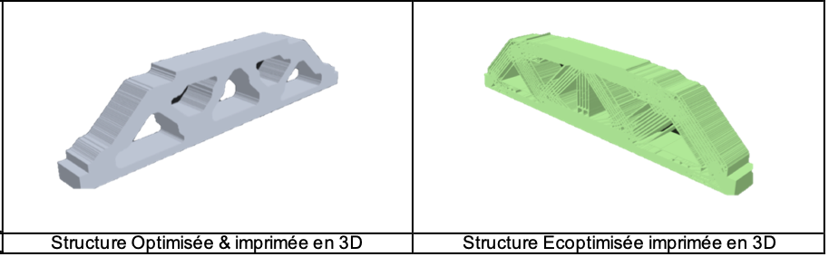

# ECODD : ECoconcevoir les aérostructures Optimales De Demain
https://anr.fr/fileadmin/aap/2021/selection/mrsei-selection-vague-1-2021.pdf

En prévision de 2050, le tonnage total de béton, d'acier, d'aluminium etc… nécessaire au développement des énergies vertes sera de 2 à 8 fois la production mondiale de 2010. Comment s’adapter à ce contexte et s’inscrire dans le cadre d’une recherche aérospatiale plus verte ? La réponse passera en partie vers la conception de matériaux architecturés et des structures fonctionnels possédant des propriétés et des fonctions particulières. L’impact sera alors déterminant dans l’optique d’une minimisation de masse ou d’impact CO2. Toutefois, la conception de ces éco-structures ne peut pas être abordée avec les règles existantes qui sont appliquées dans le développement actuel des aérostructures. Le projet ANR MRSEI ECODD, entend révolutionner le processus d’exploration de ces structures combinant l’exploitation des différentes méthodes d’optimisation topologique (implicite, explicite, multi échelle), des méthodes d’accélération via modèles de substitution, ainsi que le lien vers l’impression 3D, et les structures souples. 

L’objectif du projet est de développer une méthode innovante de construction de structures optimales éco conçues.  Ce travail transverse et collaboratif couvre le champ de la conception optimale des matériaux/structures mais aussi des procédés via l’analyse de cycle de vie et le bilan d’impact CO2 du procédé (incluant type de transport, lieu de fabrication, recyclabilité etc…) ainsi que le calcul haute performance raisonné. Le projet vise, en premier lieu, à concevoir, puis à fabriquer (via impression 3D) et tester des structures micro-architecturées et, en second lieu, à accélérer le cycle de conception/calcul via des techniques d’intelligence artificielle. Enfin l’objectif final serait d’initier la conception/fabrication de structures multifonctionnelles, multimatériaux et à déformation programmable sur quelques pièces ciblées d’aérostructures. Ce projet financé par l’ANR vise le dépôt d’une ERC Synergy Grant d’ici 2 ans avec 3 partenaires internationaux.
